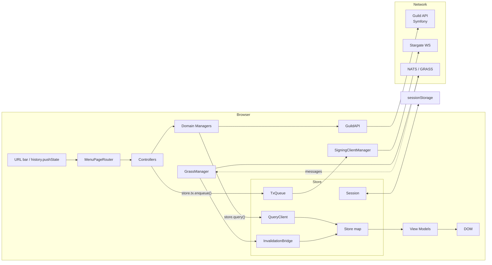
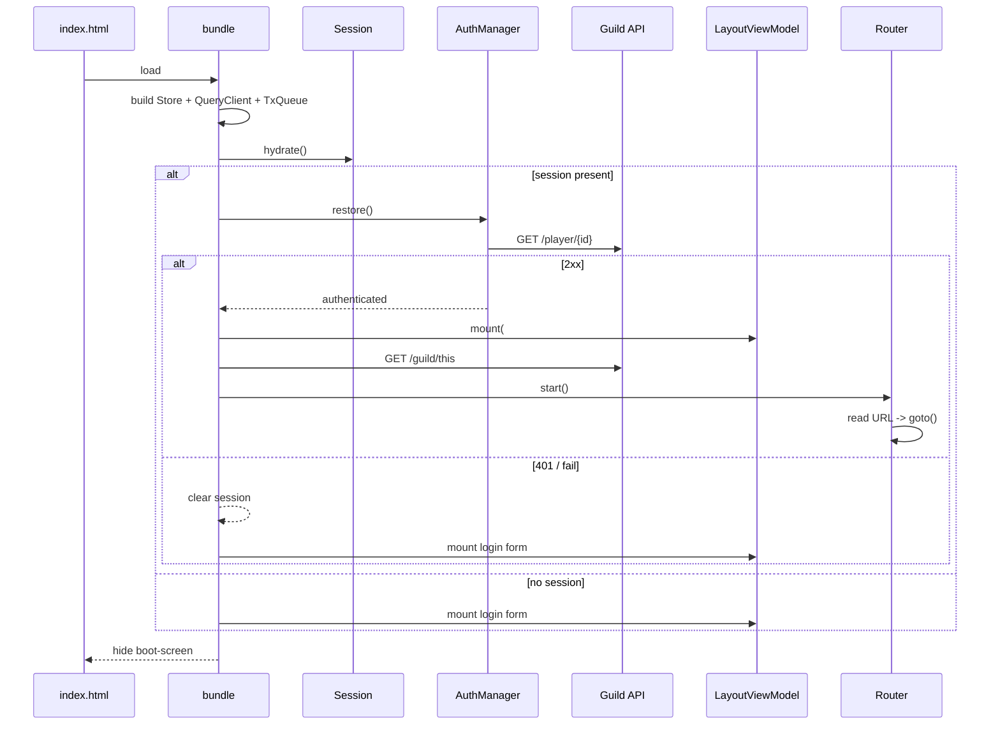

# Architecture

A single-page admin UI for guild operators of the Structs game. Vanilla JS + Webpack + Bootstrap. No React, no Vite.

## High-level data flow



## Single source of truth: the Store

A `Map<serialized key, Resource<T>>` plus per-key subscribers. Every view model that needs server data subscribes to one or more cache keys; it doesn't keep a copy.

```
Resource<T> = {
  status:    "idle" | "loading" | "success" | "error" | "missing",
  data:      T | null,
  error:     Error | null,
  updatedAt: number,    // ms epoch
  stale:     boolean,
}
```

Cache keys are arrays from `store/keys.js` -- centralized so the invalidation bridge can match wildcards (`["player", "*"]`).

## Read path

```
Controller        Manager              QueryClient            Store           View Model
   │                  │                     │                   │                │
   │  fetchPlayer(id) │                     │                   │                │
   ├─────────────────►│                     │                   │                │
   │                  │  store.query(...)   │                   │                │
   │                  ├────────────────────►│                   │                │
   │                  │                     │  read fresh?      │                │
   │                  │                     ├──────────────────►│                │
   │                  │                     │◄── yes ────────┐  │                │
   │                  │◄── return Resource ─┤                │  │                │
   │                  │                     │                │  │                │
   │                  │                     │  no -- fetch...│  │                │
   │                  │                     │ ┌──────────────┘  │                │
   │                  │                     │ ▼                 │                │
   │                  │                     │ GuildAPI ───► HTTP                 │
   │                  │                     │ │   write          │                │
   │                  │                     │ └────────────────►│  notify()────► │
```

## Write path

```
View Model          Manager              Store.tx             Stargate          Confirm strategy
   │                  │                     │                     │                   │
   │  button click    │                     │                     │                   │
   ├─────────────────►│                     │                     │                   │
   │                  │  store.tx.enqueue   │                     │                   │
   │                  ├────────────────────►│                     │                   │
   │                  │   optimistic patch  │                     │                   │
   │                  │                     │  signAndBroadcast   │                   │
   │                  │                     ├────────────────────►│                   │
   │                  │                     │◄─── hash ───────────┤                   │
   │                  │                     │   poll getTx(hash)  │                   │
   │                  │                     ├──────────────────────────────────────► │
   │                  │                     │◄────── confirmed / failed ─────────────┤
   │                  │                     │   invalidate cache keys                 │
   │  re-render       │                     │   rollback patch on failure             │
```

## Invalidation bridge

GRASS messages arrive with a subject (`structs.player.created`, etc.). `InvalidationBridge` maps subjects to cache keys to mark stale. Stale keys with active subscribers are immediately refetched in the background -- the view model never knows the difference.

This means a listener doesn't have to do `guildAPI.getPlayer(id)` manually: declare the invalidation, and the next render fires the fetch.

## Boot sequence



## Page composition

Each page has:

- a **controller** (`src/js/controllers/FooController.js`) registered (lazily) with the router
- a **page view model** (`src/js/view_models/FooViewModel.js` or inline in the controller file)
- zero or more **components** (`src/js/view_models/components/*`)

Controllers are small: they call `Manager.fetchX()` to kick off loads, then mount a view model in the layout's content slot. View models subscribe to cache keys and re-render on changes.

## Authentication

Cookie-based. The login flow:

1. user inputs mnemonic + guild ID
2. `WalletManager.createWallet(mnemonic)` -> address + pubkey
3. `GuildAPI.getTimestamp()`
4. message = `LOGIN_GUILD{guildId}ADDRESS{address}DATETIME{ts}`
5. `WalletManager.signMessage()` -> hex signature
6. `GuildAPI.getPlayerIdByAddressAndGuild()`
7. `GuildAPI.login({ address, pubkey, guild_id, unix_timestamp, signature })` -- server sets HttpOnly cookie
8. `Session.persist({ mnemonic, address, pubkey, playerId, guildId })` to **sessionStorage** (not local!)
9. `SigningClientManager.connect()` -- creates Stargate client for tx submission

All subsequent fetches go with `credentials: "include"`.

## Code splitting

`MenuPageRouter.registerLazyController(name, () => import("..."))` registers controllers as dynamic imports. Webpack emits one chunk per controller. The initial bundle is `index.js + runtime + cosmjs + bootstrap + vendors + the layout view models`; everything else loads on first navigation to its page.

## Static hosting + cross-origin API

The SPA is intended to be served from a static CDN. `public/config.js` is loaded as a plain script before the bundle and exposes `window.STRUCTS_CONFIG` so the same build can target any Guild API host without rebuilding.

CORS requirements for the API are in `docs/guild-api-requirements.md`.
