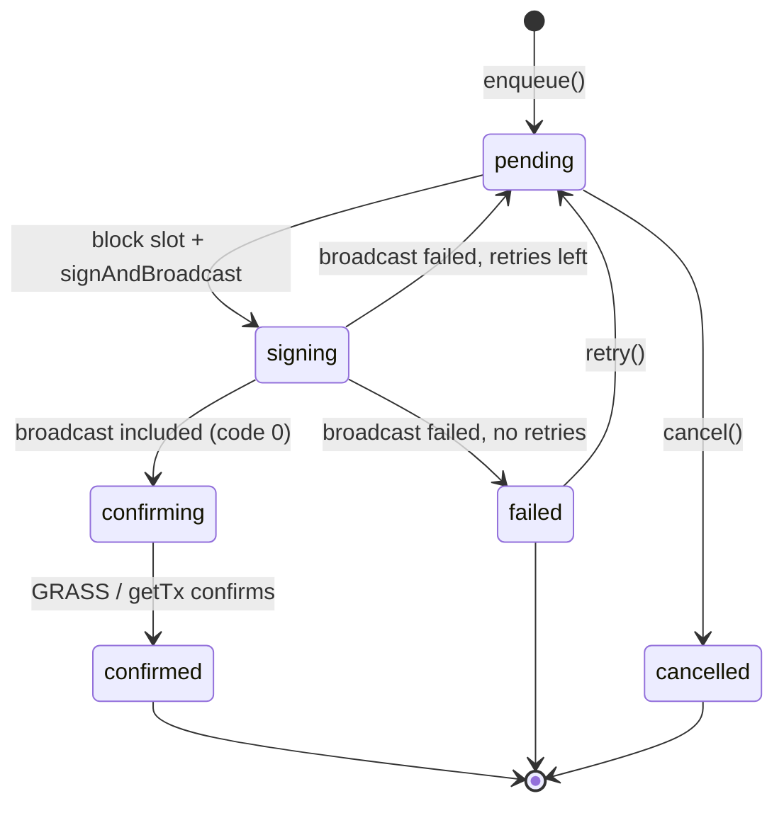

# Transactions: the developer / UI guide

This is the canonical reference for **issuing, monitoring, reviewing, and acting on chain transactions** in `structs-control`. If you are building any feature that writes to chain state, read this — you should never need to open `src/js/store/TxQueue.js` to use the system correctly.

- Code: [`src/js/store/TxQueue.js`](../src/js/store/TxQueue.js) (the queue), [`src/js/constants/SigningQueueConstants.js`](../src/js/constants/SigningQueueConstants.js) (`TX_STATUS`, tunables).
- Access it as **`store.tx`** (a `TxQueue` instance). Never construct your own.
- It is ported from `structs-webapp`'s `SigningQueueManager`, minus the game-specific charge lanes, plus this repo's `optimisticPatch` + cache `invalidate` integration.

---

## 1. Mental model

`store.tx` is a **serialized, block-paced signing queue**. You hand it a message; it owns everything else: ordering, broadcasting, confirmation, retries, persistence, and settlement.

Key guarantees:

- **Serialized** — at most one transaction is being signed/broadcast at a time, so the account sequence never races. The next tx is not signed until the previous `signAndBroadcast` has resolved (and is therefore already in a block).
- **Block-paced** — one tx is released per block, driven by the `structs:block:height-changed` GRASS event. When GRASS is offline a timer fallback keeps the queue draining.
- **Persistent** — the active queue is mirrored to `sessionStorage` per `wsUrl:address`, so a page reload does not lose queued work. (It clears on logout.)
- **Observable** — subscribe for reactive updates, `await` for the final result, or listen to `structs:tx:*` window events.

### Lifecycle / state machine



| Status | Meaning | Terminal? | In-flight? (counts toward `pendingCount`) |
| --- | --- | --- | --- |
| `pending` | Queued, waiting for a broadcast slot | no | yes |
| `signing` | `signAndBroadcast` in flight (the single in-flight slot) | no | yes |
| `confirming` | Broadcast included; waiting for GRASS / `getTx` | no | yes |
| `confirmed` | In a block, code 0 | **yes** | no |
| `failed` | Broadcast/inclusion failed, retries exhausted | **yes** | no |
| `cancelled` | Operator cancelled before broadcast | **yes** | no |

Compare against the runtime enum, not raw strings:

```js
import { TX_STATUS } from "@/constants/SigningQueueConstants.js";
if (record.status === TX_STATUS.CONFIRMED) { /* ... */ }
```

---

## 2. Issuing a transaction

The path is always: **Manager builds the message → `store.tx.enqueue(msg, options)`**. View models and controllers never call `signAndBroadcast`, never `fetch`, and never build raw cosmjs clients.

```js
// In a Manager: build the typed message (creator = signing address).
buildDoX(thingId, value) {
  return buildThingDoX({ creator: this._creator(), thingId, value });
}

// In a Manager method or controller handler: enqueue it.
const tx = await this.store.tx.enqueue(this.buildDoX(id, value), {
  invalidate: [keys.thing(id)],
});
```

### `enqueue(msg, options)`

- `msg`: `{ typeUrl: string, value: object }` — a cosmjs `EncodeObject`. Build it with the helpers in [`src/js/util/txMessages.js`](../src/js/util/txMessages.js). `value` must be JSON-serializable (validated on enqueue).
- `options` (all optional):

| Option | Type | What it does |
| --- | --- | --- |
| `memo` | `string` | Tx memo. |
| `invalidate` | `CacheKey[]` | Cache keys marked stale **after confirmation**, so subscribed view models refetch. Use `keys.*(id)`. |
| `optimisticPatch` | `(store) => (() => void)` | Apply an immediate, optimistic store write; return a rollback fn. Applied on enqueue, **rolled back automatically on terminal failure**. |
| `retryLimit` | `number` | Extra broadcast attempts on *broadcast* failure. `0` (default) = one attempt; `-1` = infinite. (Never resubmits a tx that already reached the chain.) |

- **Returns** `Promise<TxRecord>` that resolves (never rejects) when the tx settles. The resolved record is the same object held in the queue.

### Two ways to call it

```js
// (a) Await the outcome and react to it:
const tx = await this.store.tx.enqueue(msg, { invalidate: [keys.thing(id)] });
if (tx.status === TX_STATUS.CONFIRMED) {
  notify.toast("Saved", "success");
} else {
  // Failure/cancel: optimisticPatch (if any) is already rolled back, and a
  // danger toast was already surfaced. Add view-specific handling here.
}
```

```js
// (b) Fire-and-forget — the queue + Activity page track it for the operator:
void this.store.tx.enqueue(msg, { invalidate: [keys.thing(id)] });
```

> **Rule:** always check `record.status` rather than assuming success. `enqueue` resolves on *both* success and failure.

### Optimistic update recipe

```js
await this.store.tx.enqueue(this.manager.buildRename(id, name), {
  invalidate: [keys.thing(id)],
  optimisticPatch: (store) => {
    const prev = store.read(keys.thing(id));
    store.write(keys.thing(id), { ...prev, data: { ...prev.data, name }, stale: true });
    return () => store.write(keys.thing(id), prev); // rollback on failure
  },
});
```

---

## 3. Monitoring state

### Reactive subscription (preferred for UI)

```js
// In a view model mount():
this._unsubs.push(this.store.tx.subscribe(() => this.update()));
```

`subscribe(fn)` returns an unsubscribe function and fires on every queue change. Inside, read:

| Method | Returns |
| --- | --- |
| `store.tx.list()` | `TxRecord[]` — all records (queue + history), a copy. |
| `store.tx.queue()` | `TxRecord[]` — pending records in broadcast order. |
| `store.tx.pendingCount()` | `number` — count of in-flight (non-terminal) txs. Drives the header badge. |
| `store.tx.getTransaction(id)` | `TxRecord \| null`. |

### `TxRecord` shape

```ts
{
  id: string;            // client-side id (use as React-style key)
  typeUrl: string;       // e.g. "/structs.structs.MsgPlayerUpdateName"
  msg: { typeUrl, value }; // the cosmjs EncodeObject
  memo: string;
  status: TxStatus;      // see the state table above
  attempts: number;      // broadcast attempts made
  retryLimit: number;
  invalidate: CacheKey[];
  hash?: string;         // tx hash once broadcast
  height?: number;       // block height once confirmed
  error?: string;        // human-readable error on failure
  createdAt: number;     // ms epoch
  updatedAt: number;     // ms epoch
}
```

### Event-driven alternative

For code that prefers events over subscription, `TxQueue` dispatches window `CustomEvent`s (names in `EVENTS`): `TX_ENQUEUED`, `TX_BROADCAST`, `TX_CONFIRMED`, `TX_FAILED` (failed **and** cancelled). Every payload is `{ id, status, typeUrl, hash, height, error }`.

```js
import { EVENTS } from "@/constants/Events.js";
window.addEventListener(EVENTS.TX_CONFIRMED, (e) => console.log(e.detail.hash));
```

Most UI should use `subscribe()`; reserve events for cross-cutting concerns. Listeners added in a view model `mount()` must be cleaned up in `unmount()`.

---

## 4. Reviewing results

- **Final outcome**: `const tx = await store.tx.enqueue(...)` or `await store.tx.whenSettled(id)`. Then branch on `tx.status`.
- **Success**: `tx.hash` (tx hash) and `tx.height` (inclusion block) are populated.
- **Failure**: `tx.error` holds a human-readable reason. A danger toast is already surfaced by the queue.
- `whenSettled(id)` resolves immediately if already terminal, and resolves with a synthetic `{ status: "failed", error: "unknown transaction" }` for an unknown/evicted id — it never hangs.

How confirmation actually resolves (so your UI sets realistic expectations): after `signAndBroadcast` returns code 0 the tx is **already included on-chain**. The `confirming` state is a short best-effort wait (GRASS first, then `getTx` polling) used to time cache invalidation with chain-state propagation; it will not downgrade a successfully-broadcast tx to failed.

---

## 5. Understanding timelines

```js
const eta = store.tx.estimateWait(id);
// -> { position, blocksRemaining, etaMs } | null
const avgMs = store.tx.getAvgBlockMs(); // rolling average block time
```

- `position` — 1-based slot in the pending queue (`0` while signing/confirming).
- `blocksRemaining` — blocks until this tx broadcasts (one tx per block).
- `etaMs` — `blocksRemaining * getAvgBlockMs()`.

Render something like `Position 3 · ~18s`. The `/alerts` Activity page uses exactly these to show queue ETAs.

---

## 6. Acting on queued transactions

| Method | Valid when | Returns | Notes |
| --- | --- | --- | --- |
| `cancel(id)` | status is `pending` | `boolean` | Cannot cancel the in-flight (`signing`/`confirming`) tx. Rolls back its optimistic patch. |
| `retry(id)` | status is `failed` | `boolean` | Re-queues at the back; re-applies the optimistic patch if one was provided. |
| `reorder(id, index)` | status is `pending` | `boolean` | Move within the pending queue (0-based, clamped). |
| `moveUp(id)` / `moveDown(id)` | status is `pending` | `boolean` | Convenience wrappers over `reorder`. |
| `getTransaction(id)` | any | `TxRecord \| null` | |

All of these return `false` (no-op) when the action isn't valid for the record's current state — safe to wire directly to buttons. The `/alerts` Activity page ([`src/js/controllers/ActivityController.js`](../src/js/controllers/ActivityController.js)) is the reference implementation.

---

## 7. Persistence & session semantics

- The **active** queue (`pending` / `signing` / `confirming`) is persisted to `sessionStorage`, keyed `signingQueue:{wsUrl}:{address}`. It rehydrates automatically when the signing client attaches after login/restore.
- On reload, a tx that was **mid-broadcast** (`signing`/`confirming`) is restored as **`failed`** with an "interrupted" note — the queue never silently re-broadcasts something that may already have landed. The operator can `retry` it deliberately after verifying.
- `optimisticPatch` and its rollback are **session-only** (functions can't be persisted). Do **not** rely on an optimistic store write surviving a reload — only the durable `invalidate` keys persist.
- `store.tx.clear()` (called on logout) drops all records and the persisted snapshot.
- Persistence uses `sessionStorage` (never `localStorage`), consistent with the repo's secrets policy.

---

## 8. Worked example: an admin action button

```js
// 1) Manager: typed builder + enqueue helper.
class ThingManager {
  _creator() { return this.store.session?.data?.address ?? ""; }

  buildArchive(thingId) {
    return buildThingArchive({ creator: this._creator(), thingId });
  }

  async enqueueArchive(thingId) {
    return this.store.tx.enqueue(this.buildArchive(thingId), {
      invalidate: [keys.thing(thingId), keys.thingList()],
      optimisticPatch: (store) => {
        const prev = store.read(keys.thing(thingId));
        store.write(keys.thing(thingId), { ...prev, data: { ...prev.data, archived: true }, stale: true });
        return () => store.write(keys.thing(thingId), prev);
      },
    });
  }
}

// 2) View model: reflect status on the button, handle the outcome.
async onArchiveClick(thingId) {
  this.archiving = true; this.update();
  const tx = await this.manager.enqueueArchive(thingId);
  this.archiving = false;
  if (tx.status !== TX_STATUS.CONFIRMED) { this.update(); return; } // rolled back + toasted
  notify.toast("Archived", "success");
  // No manual refetch needed — `invalidate` refreshes subscribed views.
}
```

---

## 9. Do / Don't (for agents)

**Do**

- Build messages in a Manager with the `txMessages.js` helpers; enqueue via `store.tx.enqueue`.
- Pass `invalidate` keys so confirmed txs refresh the right reads.
- Check `record.status` before treating a tx as successful.
- Subscribe to `store.tx` (and clean up in `unmount()`) for live UI.
- Use `TX_STATUS` constants, not string literals, in comparisons.

**Don't**

- Don't call `signingClient.signAndBroadcast` directly. Ever. Go through the queue.
- Don't `fetch` from a view model or stash tx records in a view-model field — read from `store.tx`.
- Don't rely on `optimisticPatch` surviving a reload.
- Don't assume `await enqueue(...)` means success — it resolves on failure too.
- Don't build a second queue or re-broadcast a `confirming` tx; the queue owns broadcast and confirmation.
